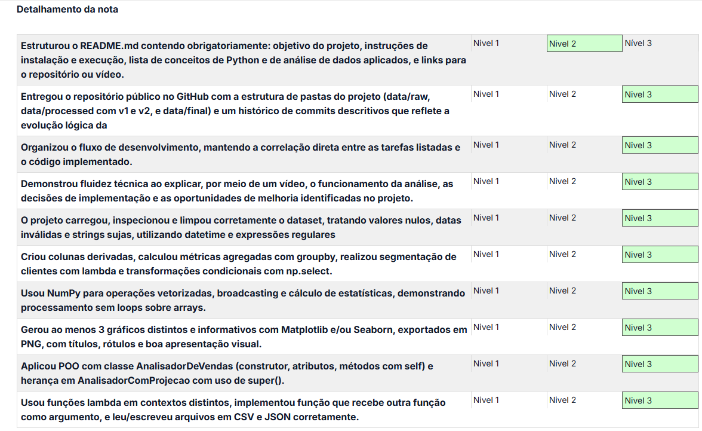

# 🏆 Avaliação — Wood Insight PY

Registro da avaliação realizada durante a formação **Desenvolvimento de Inteligência Artificial para Análise Preditiva**, do **SENAI/SC**.

---

## 📊 Resultado

| Informação | Resultado |
|---|---|
| **Nota** | **97,37 / 100,00** |
| **Avaliado em** | 23 de setembro de 2026, às 17:30 |
| **Avaliador** | Lucas Ribeiro de Lima |
| **Status** | ✅ Avaliado |

---

## 💬 Feedback recebido

> Entrega forte, cobrindo bem o que foi pedido. Limpeza dos dados, colunas derivadas, agregações, segmentação de clientes, operações com NumPy, visualizações customizadas e exportação completa dos resultados, tudo presente, e ainda foram além com gráficos e tabelas extras. Faltou só um detalhe na documentação: o README não traz o link do vídeo de demonstração junto com o resto das informações.

---
## 📋 Rubrica de avaliação

A avaliação do projeto foi realizada com base na rubrica apresentada na formação.

### Níveis de avaliação

  

## 📋 Detalhamento da avaliação

O projeto foi avaliado com base em critérios relacionados à organização do repositório, desenvolvimento em Python, análise de dados, visualização, programação orientada a objetos, manipulação de arquivos e documentação.

### Resultado por critério

| Critério | Resultado |
|---|---|
| README com objetivo, instalação, execução, conceitos aplicados e links | ⚠️ Oportunidade de melhoria |
| Estrutura do repositório e histórico de commits | 🟢 Nível 3 |
| Correlação entre tarefas e código implementado | 🟢 Nível 3 |
| Vídeo demonstrando análise, decisões e oportunidades de melhoria | 🟢 Nível 3 |
| Carregamento, inspeção e limpeza dos dados | 🟢 Nível 3 |
| Colunas derivadas, agregações e segmentação de clientes | 🟢 Nível 3 |
| Operações vetorizadas, broadcasting e estatísticas com NumPy | 🟢 Nível 3 |
| Visualizações com Matplotlib e/ou Seaborn | 🟢 Nível 3 |
| Programação Orientada a Objetos e herança | 🟢 Nível 3 |
| Funções lambda e manipulação de arquivos CSV e JSON | 🟢 Nível 3 |

---

## ⚠️ Ponto de melhoria identificado

O único critério que não atingiu o nível máximo foi o relacionado à documentação do `README.md`.

O requisito previa que o README apresentasse:

- objetivo do projeto;
- instruções de instalação e execução;
- conceitos de Python e análise de dados aplicados;
- links para o repositório ou vídeo de demonstração.

O feedback apontou especificamente a **ausência do link do vídeo de demonstração junto às demais informações do README**.

### 🔎 Aprendizado

Esse feedback reforçou a importância de tratar a documentação como parte integrante do desenvolvimento de um projeto, garantindo que as informações necessárias para compreender, executar e avaliar a solução estejam centralizadas e facilmente acessíveis.

---

## 🧩 Competências avaliadas

Durante a avaliação, foram reconhecidas diferentes competências técnicas aplicadas no projeto:

### 🐍 Python

- Manipulação e transformação de dados
- Funções e funções `lambda`
- Programação Orientada a Objetos
- Classes, atributos e métodos
- Construtor e uso de `self`
- Herança e utilização de `super()`
- Leitura e escrita de arquivos

### 📊 Análise de dados

- Limpeza e preparação de dados
- Tratamento de valores nulos
- Tratamento de datas inválidas
- Expressões regulares
- Criação de colunas derivadas
- Agregações com `groupby`
- Segmentação de clientes
- Transformações condicionais com `np.select`

### 🔢 NumPy

- Operações vetorizadas
- Broadcasting
- Cálculo de estatísticas
- Processamento de arrays sem utilização de loops

### 📈 Visualização de dados

- Matplotlib
- Seaborn
- Criação de gráficos informativos
- Personalização de visualizações
- Exportação dos gráficos em PNG

### 📁 Manipulação de arquivos

- CSV
- JSON
- Organização e exportação dos resultados

---

## 📌 Síntese da avaliação

O **Wood Insight PY** obteve **97,37/100,00**, com avaliação **Nível 3 nos critérios técnicos e de desenvolvimento**, conforme a rubrica utilizada.

A avaliação reconheceu a aplicação dos conhecimentos de **Python, análise de dados, NumPy, visualização, segmentação, programação orientada a objetos e manipulação de arquivos**, além da organização do projeto e da entrega de resultados adicionais.

A principal oportunidade de melhoria identificada foi relacionada à **documentação do README**, especificamente à inclusão do link do vídeo de demonstração.

---

## 🚀 Próximos aprendizados

A partir do feedback recebido, alguns pontos podem ser incorporados aos próximos projetos:

- 🔗 garantir que todos os links importantes estejam disponíveis no README;
- 📚 tratar a documentação como parte do entregável técnico;
- 🎥 facilitar o acesso às demonstrações do projeto;
- 📝 revisar o README utilizando a rubrica de avaliação antes da entrega;
- 🔍 utilizar feedbacks recebidos como referência para aprimorar projetos futuros.

---

> ⭐ **Resultado final: 97,37 / 100,00**
>
> Este registro faz parte da documentação da minha jornada de aprendizagem em **Python, Análise de Dados e Inteligência Artificial para Análise Preditiva**.